# Processes & Threads

Everything you wrote in AIS1003 had a single **thread of control**: one line ran, then the next, in an order you could trace with a finger. This chapter introduces the idea that a program can have *several* threads of control running at once — and the operating-system machinery that makes that possible.

We start with vocabulary, because the words *process*, *thread*, *concurrency* and *parallelism* are used loosely in everyday speech and precisely in this course.

---

## What is a process?

A **process** is a running program. When you double-click an executable or launch it from a terminal, the operating system creates a process for it: a private chunk of memory, an open-files table, and at least one thread to run the code.

The defining property of a process is **isolation**. Each process has its own address space, so one process cannot reach into another's memory and read or scribble on its variables. If a robot's vision program crashes, the control program in a separate process keeps running. That isolation is a safety feature — and the reason processes cannot share data simply by naming a variable. To talk, they must use **inter-process communication**: pipes, sockets, shared files. That is the subject of [Part 4](../Chapter4/serialization.md).

## What is a thread?

A **thread** is a single sequence of execution *within* a process. Every process starts with one thread (the one that runs `main`), and can create more. All the threads of a process **share that process's memory** — the same heap, the same global variables, the same objects.

That sharing is exactly what makes threads powerful and dangerous:

- **Powerful**, because threads communicate by simply reading and writing shared variables — no sockets, no serialization, no copying.
- **Dangerous**, because two threads touching the same variable at the same time is the central hazard of this entire course (see [Sharing Data](sharing_data.md)).

| | Process | Thread |
|---|---|---|
| Memory | Private address space | Shared with other threads in the process |
| Created by | Launching a program | Code, via `std::thread` / `std::jthread` |
| Communication | IPC: sockets, pipes, files | Shared variables (with synchronisation) |
| Cost to create | High | Low |
| If one crashes | Others survive | Usually takes the whole process down |
| Context switch | Expensive | Cheaper |

A useful mental image: a **process is a house**, with its own walls and its own front door. The **threads are the people inside** — they share the kitchen, the fridge, every room. People in the same house can hand things to each other directly; people in *different* houses have to post a letter.

---

## Concurrency vs parallelism

These two words are not synonyms, and the distinction matters.

- **Concurrency** is a property of your *program*: it is structured as multiple independent tasks that are *in progress* at the same time. Whether they truly run simultaneously is not the point — the point is that they are not forced into a single sequence.
- **Parallelism** is a property of the *hardware*: multiple tasks literally execute *at the same instant*, on different CPU cores.

You can have concurrency without parallelism. On a single-core CPU, the operating system runs one thread for a few milliseconds, pauses it, runs another, and so on — fast enough that they *appear* simultaneous. This is **time-slicing**, and the act of pausing one thread to run another is a **context switch**.

```mermaid
gantt
    title One core, time-sliced (concurrent, not parallel)
    dateFormat X
    axisFormat %S
    section Core 0
    Thread A :a1, 0, 1s
    Thread B :b1, after a1, 1s
    Thread A :a2, after b1, 1s
    Thread B :b2, after a2, 1s
```



With more than one core, threads run **in parallel** — genuinely at the same time:

```mermaid
gantt
    title Two cores (parallel)
    dateFormat X
    axisFormat %S
    section Core 0
    Thread A :0, 4
    section Core 1
    Thread B :0, 4
```



For a cyber-physical system both ideas pay off: concurrency lets you *structure* the program as "read sensors", "run control loop", "stream telemetry" as separate tasks; parallelism lets those tasks actually run at once on the Pi's four cores.

!!! note "You do not choose which core runs what"
    The operating system's **scheduler** decides which thread runs on which core, and when. You can hint, but you cannot dictate. This is why you can never assume anything about the *order* in which threads make progress — a fact the next chapter turns into hard rules.

---

## Why bother? The blocking problem

The most common reason to reach for a thread is to stop one slow task from freezing everything else. Consider a program that reads a sensor over a slow serial link and also updates a display. Written sequentially, reading the sensor **blocks** — the whole program sits and waits:

<!-- no-ce -->
```cpp
int main() {
    while (true) {
        double value = readSensor();   // blocks for 100 ms waiting for data
        updateDisplay(value);          // the display freezes during that wait
    }
}
```

While `readSensor()` waits, `updateDisplay()` cannot run, and the interface stutters. Put the slow work on its own thread and the main thread stays responsive. Threads are one answer to this; [Part 3](../Chapter3/futures.md) covers the others (futures, coroutines, async I/O), because a thread is not always the right tool.

---

## A first thread

C++ has had threads in the standard library since C++11, in the `<thread>` header. Here is the smallest interesting program: `main` starts a second thread, and both run.

```cpp
#include <iostream>
#include <thread>

void greet() {
    std::cout << "Hello from the worker thread\n";
}

int main() {
    std::thread worker(greet);   // the worker thread starts running greet() now
    std::cout << "Hello from main\n";
    worker.join();               // wait for the worker to finish before exiting
}
```

Two things deserve attention.

**The output order is not fixed.** `main` and `worker` run concurrently, so "Hello from main" may print before or after "Hello from the worker thread" — or, on a bad day, the two lines may interleave mid-text. Run it a few times. That nondeterminism is normal and is the first thing to internalise about threads.

**`join()` is not optional.** A `std::thread` must be either *joined* (wait for it to finish) or *detached* (let it run free) before it is destroyed. Forget both, and the `std::thread` destructor calls `std::terminate()` and kills your program:

<!-- no-ce -->
```cpp
int main() {
    std::thread worker(greet);
    // no join(), no detach()
}   // worker's destructor runs here → std::terminate() → crash
```

This is a deliberate design choice: silently abandoning a thread is almost always a bug, so the language refuses to guess. The [next chapter](threads.md) introduces `std::jthread`, the C++20 type that joins itself automatically and removes this footgun entirely.

---

## How many threads make sense?

More threads is not faster. Every thread costs memory (a stack, often ~1 MB) and every context switch costs time. Past the number of CPU cores, extra compute-bound threads mostly fight each other for the same cores and add overhead.

The standard library reports a sensible upper bound:

```cpp
#include <iostream>
#include <thread>

int main() {
    unsigned int cores = std::thread::hardware_concurrency();
    std::cout << "This machine reports " << cores << " hardware threads\n";
}
```

A good default for **CPU-bound** work is roughly one thread per hardware thread. For **I/O-bound** work — threads that spend most of their time *waiting* on a sensor, a disk or a network — you can profitably have many more, because a waiting thread is not using a core. Rather than spawn threads by hand for every little task, you usually hand work to a [thread pool](../Chapter3/thread_pools.md) sized to the machine.

!!! warning "`hardware_concurrency()` can return 0"
    It is allowed to return `0` if the implementation cannot determine the count. Treat it as a hint: `unsigned int n = std::max(1u, std::thread::hardware_concurrency());`.

---

## Summary

- A **process** is an isolated running program with its own memory; a **thread** is a sequence of execution inside a process that **shares** that process's memory with sibling threads.
- Threads communicate cheaply through shared variables — which is both their great advantage and the source of every hazard in [the next chapter](sharing_data.md).
- **Concurrency** is a way of structuring a program (tasks in progress at once); **parallelism** is the hardware running them simultaneously. You get concurrency on one core via time-slicing and context switches.
- The **scheduler**, not you, decides what runs when — so never rely on the order in which threads make progress.
- Start a thread with `std::thread`; you **must** `join()` or `detach()` it before it is destroyed, or the program terminates. C++20's [`std::jthread`](threads.md) fixes this.
- More threads is not automatically faster: size thread use to `hardware_concurrency()` for compute-bound work, and prefer a [thread pool](../Chapter3/thread_pools.md) over hand-spawning.
