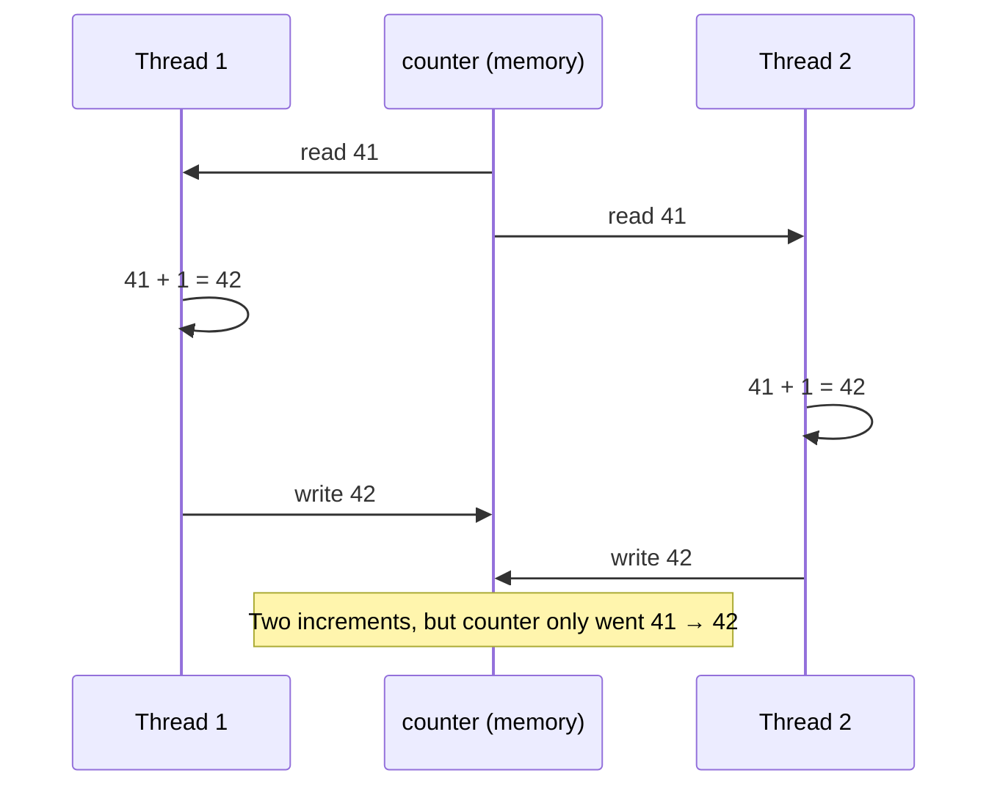
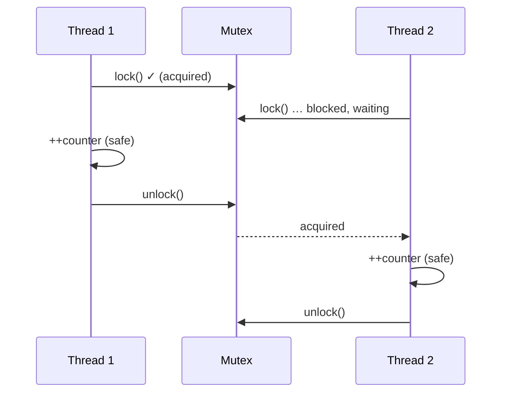
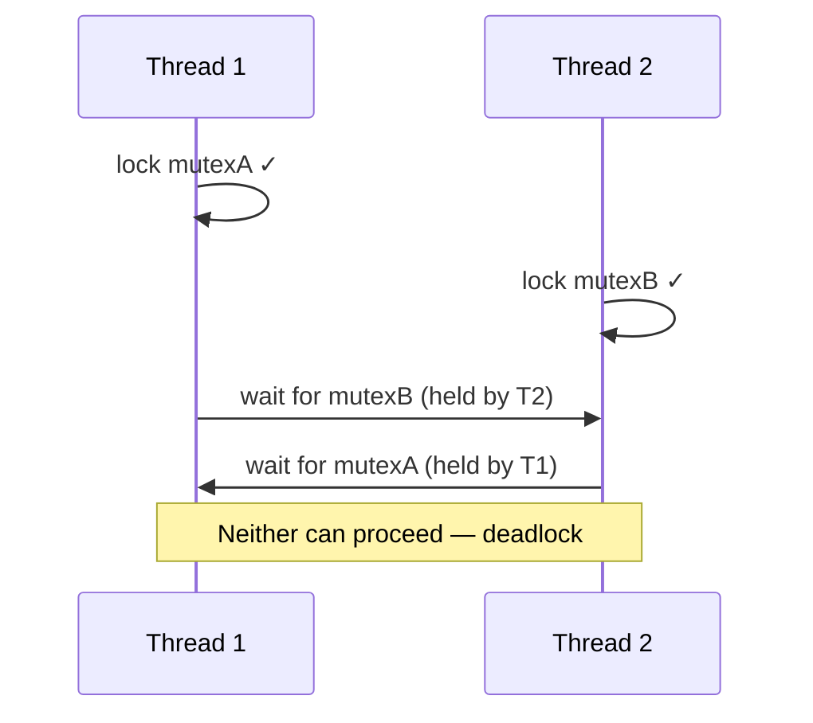

# Sharing Data

Threads share memory. That is what makes them cheap to communicate with — and it is also what makes multithreaded programming hard. The moment two threads touch the same data and at least one of them writes, you have a potential **race condition**: a bug whose appearance depends on the exact timing of the two threads, and which may therefore strike one run in a thousand.

This chapter is the heart of Part 2. It shows the hazard concretely, then builds up the standard tools for shutting it down: the **mutex**, the RAII lock wrappers, and the discipline that avoids **deadlock**.

---

## A race condition you can watch fail

Here is a program with no obvious bug. Two threads each increment a shared counter one million times. The expected total is two million.

```cpp
#include <iostream>
#include <thread>

int counter = 0;   // shared between both threads

void increment() {
    for (int i = 0; i < 1'000'000; ++i) {
        ++counter;
    }
}

int main() {
    std::thread t1(increment);
    std::thread t2(increment);
    t1.join();
    t2.join();
    std::cout << "counter = " << counter << "\n";   // expected 2000000
}
```

Run it. You will almost certainly *not* get `2000000` — and you will get a different wrong number each time. The program is broken, and the breakage is not in the arithmetic.

The cause is that `++counter` is not one indivisible step. The CPU performs it as three:

1. **read** the current value of `counter` from memory into a register,
2. **add** one in the register,
3. **write** the register back to memory.

Now interleave two threads. Both read `41`, both add one to get `42`, both write `42`. Two increments happened, but the counter only advanced by one. The lost update is invisible in the source code and entirely a matter of timing.



!!! danger "This is undefined behaviour, not just a wrong number"
    Two threads accessing the same memory location where at least one access is a write, without synchronisation, is a **data race** — and a data race is *undefined behaviour* in C++. The program is not "usually right with an occasional off-by-one"; it has no defined meaning at all. The compiler is allowed to assume data races never happen, and may optimise in ways that produce results stranger than a lost update. Never reason about what a racy program "probably does."

---

## The critical section

The fix is to ensure that the read-modify-write on `counter` is never performed by two threads at once. The stretch of code that must not run concurrently is called the **critical section**.

The tool that enforces "only one thread in here at a time" is a **mutex** — short for *mutual exclusion*. A mutex is a lock with two operations: a thread *locks* it before entering the critical section and *unlocks* it on the way out. While one thread holds the lock, any other thread that tries to lock it **waits** until the first releases it.



`std::mutex` lives in the `<mutex>` header. You *could* call `lock()` and `unlock()` by hand — but you should not, and the next section explains why. First, see it work:

```cpp
#include <iostream>
#include <thread>
#include <mutex>

int counter = 0;
std::mutex counterMutex;

void increment() {
    for (int i = 0; i < 1'000'000; ++i) {
        counterMutex.lock();
        ++counter;             // critical section: only one thread at a time
        counterMutex.unlock();
    }
}

int main() {
    std::thread t1(increment);
    std::thread t2(increment);
    t1.join();
    t2.join();
    std::cout << "counter = " << counter << "\n";   // now reliably 2000000
}
```

This is correct: the answer is `2000000` every time. But the hand-written `lock()`/`unlock()` pair is fragile, and we can do better.

---

## RAII locks: never unlock by hand

What happens if the critical section throws an exception, or returns early, between `lock()` and `unlock()`? The `unlock()` never runs, the mutex stays locked forever, and every other thread that wants it blocks for good. This is a **deadlock** caused by a missing unlock — and with manual locking it is one stray `return` away.

You already met the solution in AIS1003: **RAII**. Bind the unlock to the destructor of a guard object, and it runs automatically when the guard leaves scope — on a normal exit, an early `return`, *or* an exception.

`std::lock_guard` is exactly that guard. It locks a mutex in its constructor and unlocks in its destructor:

```cpp
#include <iostream>
#include <thread>
#include <mutex>

int counter = 0;
std::mutex counterMutex;

void increment() {
    for (int i = 0; i < 1'000'000; ++i) {
        std::lock_guard<std::mutex> lock(counterMutex);   // locks here
        ++counter;
    }   // lock's destructor unlocks here, no matter how we leave the block
}

int main() {
    std::thread t1(increment);
    std::thread t2(increment);
    t1.join();
    t2.join();
    std::cout << "counter = " << counter << "\n";
}
```

This is the idiomatic way to use a mutex in C++. The rule is simple: **never call `mutex.lock()` and `mutex.unlock()` directly.** Always wrap the mutex in a guard.

The standard library gives you a small family of guards. You will use the first two constantly:

| Guard | Use it for |
|-------|------------|
| `std::lock_guard` | The default. Locks one mutex for a scope. Minimal and cheap. |
| `std::scoped_lock` | Like `lock_guard`, but can lock **several** mutexes at once, deadlock-free (see below). The modern default — C++17. |
| `std::unique_lock` | When you need to unlock early, lock later, or hand the lock to a [condition variable](condition_variables.md). More flexible, slightly heavier. |

!!! tip "Reach for `std::scoped_lock` by default"
    Since C++17, `std::scoped_lock` does everything `lock_guard` does and also locks multiple mutexes safely. Many style guides now recommend it as the everyday choice. This book uses `lock_guard` when locking exactly one mutex (it reads clearly) and `scoped_lock` whenever more than one is involved.

---

## Wrap the data, not just the code

A loose mutex protecting a loose variable is easy to misuse: nothing stops a future colleague from touching `counter` somewhere without taking the lock. The robust pattern is to put the data and its mutex together inside a class, and never expose the data directly. The class then *guarantees* that every access is synchronised.

```cpp
#include <iostream>
#include <thread>
#include <mutex>
#include <vector>

class Counter {
public:
    void increment() {
        std::lock_guard<std::mutex> lock(mutex_);
        ++value_;
    }

    int value() const {
        std::lock_guard<std::mutex> lock(mutex_);
        return value_;
    }

private:
    mutable std::mutex mutex_;   // mutable: locking it does not change the logical value
    int value_ = 0;
};

int main() {
    Counter counter;
    std::vector<std::thread> threads;
    for (int t = 0; t < 4; ++t) {
        threads.emplace_back([&counter] {
            for (int i = 0; i < 100'000; ++i) {
                counter.increment();
            }
        });
    }
    for (auto& thread : threads) {
        thread.join();
    }
    std::cout << "counter = " << counter.value() << "\n";   // 400000
}
```

Now the only way to touch `value_` is through `increment()` and `value()`, and both take the lock. The synchronisation is an invariant of the class, not a convention you have to remember at every call site. This is the same encapsulation idea from AIS1003, applied to thread safety. (The `mutex_` is `mutable` so that the `const` method `value()` may still lock it — locking is not a logical modification of the object.)

!!! warning "Holding a lock too long kills performance"
    A mutex serialises every thread that wants it: while one holds the lock, the rest wait. Keep critical sections **short** — lock, touch the shared data, unlock. Never do slow work (file I/O, a network call, a `sleep`) while holding a lock, or you funnel all your threads through one queue and lose the benefit of having them.

---

## Deadlock: when locks wait forever

A mutex makes threads wait. Make two threads wait *for each other* and neither can ever proceed — a **deadlock**. The classic recipe needs two mutexes and two threads that lock them in opposite orders.

Imagine transferring money between two accounts, each guarded by its own mutex:

<!-- no-ce -->
```cpp
std::mutex mutexA;
std::mutex mutexB;

void transfer1() {
    std::lock_guard<std::mutex> lockA(mutexA);   // thread 1 takes A …
    std::lock_guard<std::mutex> lockB(mutexB);   // … then wants B
    // move money from A to B
}

void transfer2() {
    std::lock_guard<std::mutex> lockB(mutexB);   // thread 2 takes B …
    std::lock_guard<std::mutex> lockA(mutexA);   // … then wants A
    // move money from B to A
}
```

Run those on two threads and the unlucky interleaving is: thread 1 locks `mutexA`, thread 2 locks `mutexB`, then thread 1 waits for `mutexB` (held by 2) while thread 2 waits for `mutexA` (held by 1). Both wait forever. The program hangs with no crash, no error message — the worst kind of failure to diagnose.



There are two reliable cures.

**Cure 1 — always lock in the same order.** If *every* thread locks `mutexA` before `mutexB`, the cycle cannot form. Consistent lock ordering is the most important deadlock-avoidance habit you can build.

**Cure 2 — lock them together with `std::scoped_lock`.** When you genuinely need two mutexes at once, let the standard library acquire them as a single atomic step. `std::scoped_lock` uses a deadlock-avoidance algorithm internally, so the order you pass them does not matter:

<!-- no-ce -->
```cpp
void transfer(Account& from, Account& to, double amount) {
    // locks BOTH mutexes at once, with no risk of deadlock
    std::scoped_lock lock(from.mutex(), to.mutex());
    from.debit(amount);
    to.credit(amount);
}
```

Both calls can pass their accounts in either order and never deadlock. This is the main reason to prefer `scoped_lock` whenever more than one mutex is involved.

!!! note "Deadlock needs four conditions"
    Formally, a deadlock requires all of: **mutual exclusion** (a resource only one thread can hold), **hold-and-wait** (holding one while waiting for another), **no preemption** (a lock cannot be forcibly taken away), and **circular wait** (a cycle of who-waits-for-whom). Break any one and deadlock is impossible. Consistent lock ordering breaks the *circular wait*; that is usually the easiest condition to attack.

---

## Two more traps

**Don't double-lock a plain mutex.** If a thread that already holds a `std::mutex` tries to lock it again — often by calling one locked method from another — the result is undefined (usually a deadlock with itself). Restructure so the lock is taken once, or, rarely, use `std::recursive_mutex` if you genuinely must re-enter.

**A `const` method is not automatically thread-safe.** `const` means "I will not modify the object", which says nothing about concurrent access. Two threads calling a `const` getter while a third calls a non-`const` setter is still a data race. `const` and thread-safety are different guarantees; do not confuse them.

---

## Summary

- Two threads accessing the same data, with at least one writing and no synchronisation, is a **data race** — and a data race is **undefined behaviour**, not merely an occasional wrong answer.
- Operations that look atomic in source (`++counter`) are not: they are read-modify-write sequences the scheduler can interrupt.
- A **mutex** enforces mutual exclusion over a **critical section**: only one thread holds it at a time; the rest wait.
- **Never** call `lock()`/`unlock()` by hand. Wrap the mutex in `std::lock_guard` (one mutex) or `std::scoped_lock` (one or more) so RAII releases it on every exit path.
- Put the **data and its mutex inside a class** and expose only synchronised methods, so thread-safety is an invariant rather than a convention. Keep critical sections short.
- **Deadlock** is two threads waiting on each other's locks forever. Avoid it by locking mutexes in a **consistent order**, or by acquiring multiple mutexes together with `std::scoped_lock`.
- Mutexes solve *mutual exclusion*. When a thread instead needs to **wait for something to become true**, that is a job for a [condition variable](condition_variables.md) — the next chapter.
