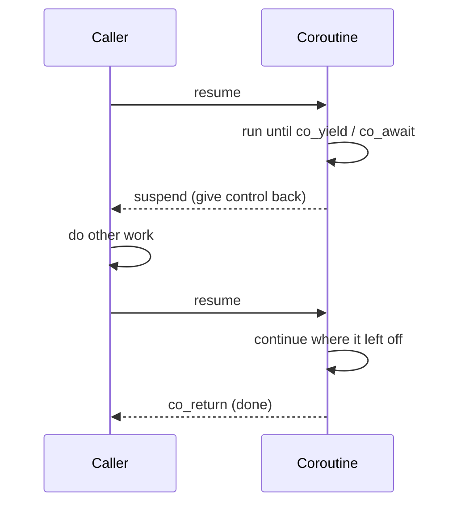

# Coroutines

Every tool so far in this part has been about *threads* — running work in parallel and getting results back. **Coroutines** are a different idea: a way to write concurrent-looking code that runs **cooperatively on a single thread**. A coroutine is a function that can **suspend** itself partway through, hand control back to its caller, and later **resume** exactly where it left off, with all its local variables intact.

This chapter is mostly conceptual, and deliberately so. C++20 coroutines are a powerful but *low-level* feature, and the honest advice — explained at the end — is to meet them through a library rather than build the machinery yourself.

---

## Suspend and resume

An ordinary function runs start to finish and then returns. A coroutine has extra control: at certain points it can pause, yielding the CPU back to whoever called it, and be picked up again later. Three new keywords mark those points, and using *any* of them makes a function a coroutine:

| Keyword | Meaning |
|---------|---------|
| `co_await` | Suspend until some operation is ready, then resume with its result. |
| `co_yield` | Produce a value and suspend — the basis of generators. |
| `co_return` | Finish the coroutine, optionally with a final value. |

The key difference from a [thread](../Chapter2/threads.md): a thread is **preemptive** — the operating system can pause it at any instant, which is why two threads racing on shared data is a hazard. A coroutine is **cooperative** — it only ever pauses at an explicit `co_await`/`co_yield`. Because *you* decide exactly where it suspends, code between two suspension points runs without interruption, and much of the data-race danger of threads simply does not arise on a single thread.



---

## Why they exist: cheap concurrency for waiting

Coroutines shine for **I/O-bound** work — programs that spend most of their time *waiting* (for a network reply, a sensor, a timer) rather than computing. The motivating example is a server handling thousands of connections at once.

With threads, one thread per connection costs a stack (often ~1 MB) and a context switch each time the OS swaps them — ten thousand idle connections is ten thousand expensive, mostly-sleeping threads. With coroutines, each connection is a coroutine that **`co_await`s** its next packet and suspends while waiting, costing little more than its local variables. A handful of threads can drive tens of thousands of coroutines, because a suspended coroutine uses no thread at all while it waits.

| | Threads | Coroutines |
|---|---|---|
| Scheduling | Preemptive (OS decides) | Cooperative (suspend at `co_await`/`co_yield`) |
| Runs in parallel? | Yes, across cores | No — concurrency on one thread (unless combined with threads) |
| Cost each | A stack + OS bookkeeping | Roughly its local variables |
| Data races | A constant hazard | Largely avoided on a single thread |
| Best for | CPU-bound work | I/O-bound work, many waiting tasks, generators |

They are not a replacement for threads — coroutines alone cannot use more than one core. The two compose: a small thread pool running many coroutines is how high-performance async servers are built.

---

## What it looks like

A **generator** — a function that lazily produces a sequence, suspending after each value — is the most approachable example. With C++23's `std::generator`:

<!-- no-ce -->
```cpp
#include <generator>   // C++23
#include <iostream>

std::generator<int> countTo(int n) {
    for (int i = 1; i <= n; ++i) {
        co_yield i;          // produce i, then suspend until asked for the next
    }
}

int main() {
    for (int value : countTo(5)) {   // resumes the coroutine each iteration
        std::cout << value << " ";   // 1 2 3 4 5
    }
}
```

`countTo` does not compute all five values up front. Each time the loop asks for the next value, the coroutine resumes, runs to the `co_yield`, hands back one number, and suspends again. Its loop counter `i` survives across suspensions — that persistent local state is what makes a coroutine more than a normal function.

An **async** example, in the style of [Boost.Asio](../Chapter4/networking.md), reads as ordinary straight-line code even though it suspends at every `co_await`:

<!-- no-ce -->
```cpp
// Asio-style: looks sequential, but suspends (without blocking a thread) at each co_await
awaitable<void> echo(tcp::socket socket) {
    char data[1024];
    for (;;) {
        std::size_t n = co_await socket.async_read_some(buffer(data));   // suspend until data
        co_await async_write(socket, buffer(data, n));                   // suspend until sent
    }
}
```

While this coroutine waits for data, it occupies no thread; the same thread services other connections. Yet there are no callbacks and no manual state machine — the `for` loop and locals read exactly like blocking code. That readability is coroutines' biggest practical win over the [callback-](futures.md)heavy async styles that preceded them.

---

## The honest caveat: use a library

Here is what trips people up. C++20 added coroutines as a *language* feature but **almost no library support**. There is no ready-made `task` type, no async runtime, and `std::generator` only arrived in **C++23**. To actually *write* a coroutine that returns a usable type, raw C++20 requires you to implement a `promise_type` and awaiter types by hand — genuinely advanced, error-prone boilerplate that is well beyond this course.

So the practical guidance is:

- **Understand the concept** — suspend/resume, cooperative scheduling, the I/O-bound use case. That is what this chapter is for, and what you will be asked about.
- **Use a library for the machinery.** Meet coroutines through something that provides the types and an event loop: **Boost.Asio** (`awaitable`, `co_spawn`) for networking, `std::generator` (C++23) for sequences, or libraries like **cppcoro**. Do not hand-roll `promise_type` for course work.
- **Reach for simpler tools first.** For most AIS2203 tasks, [threads](../Chapter2/threads.md), [futures](futures.md) and a [thread pool](thread_pools.md) are the right answer. Coroutines earn their keep at high connection counts or in genuinely async pipelines — reach for them when you hit that, through a library, not before.

---

## Summary

- A **coroutine** is a function that can **suspend** and later **resume** with its local state intact, marked by `co_await`, `co_yield`, or `co_return`.
- Scheduling is **cooperative** (it suspends only at explicit points), unlike a thread's **preemptive** scheduling — so single-threaded coroutine code largely sidesteps data races.
- They excel at **I/O-bound** work: thousands of mostly-waiting tasks (e.g. network connections) cost far less than thousands of threads, because a suspended coroutine uses no thread. They do **not** add parallelism on their own.
- C++20 coroutines are **low-level**: minimal standard-library support, `std::generator` only in C++23, and writing your own coroutine type by hand is advanced. **Use a library** (Boost.Asio, cppcoro) and reach for [threads](../Chapter2/threads.md)/[futures](futures.md)/[pools](thread_pools.md) for everyday work.
- Next: [Real-Time & Timing](real_time.md) — making concurrent work happen not just correctly, but *on time*.
