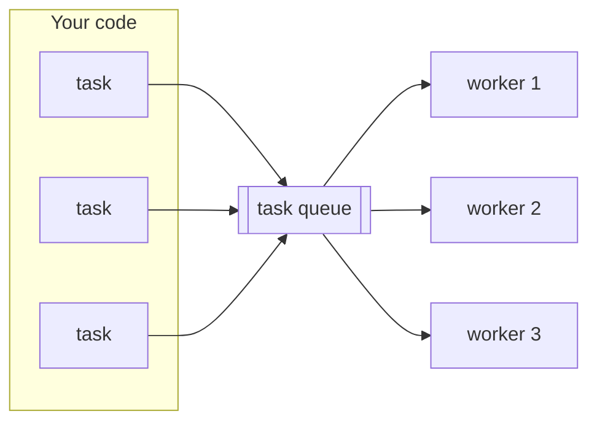

# Thread Pools

[Processes & Threads](../Chapter2/processes_threads.md) warned that threads are not free: each one costs memory and time to create. So spawning a fresh `std::thread` for every small task does not scale — if you have ten thousand short jobs, you pay the creation cost ten thousand times, and you may try to run more threads at once than the machine can handle. A **thread pool** solves this by creating a fixed set of worker threads *once* and feeding them a stream of tasks.

This chapter assembles a working pool from the two tools you already have: the producer/consumer queue from [Condition Variables](../Chapter2/condition_variables.md), and the [`std::packaged_task`](futures.md) that turns a unit of work into a future.

---

## The idea

A thread pool has two parts:

- a small number of **worker threads** — typically one per CPU core — that never stop running for the pool's lifetime;
- a **task queue** the workers pull from.

You **submit** a task; it goes on the queue; the next idle worker takes it and runs it. The threads are *reused* across thousands of tasks, so the per-task cost is just "push onto a queue", not "create a thread".



This is exactly the producer/consumer pattern: your code is the producer, the workers are consumers, and the condition variable wakes an idle worker the instant a task arrives.

---

## Building a minimal pool

Here is a complete, working pool in about forty lines. Read the annotations — every piece is something from Part 2 or the previous page.

```cpp
#include <condition_variable>
#include <functional>
#include <future>
#include <iostream>
#include <memory>
#include <mutex>
#include <queue>
#include <thread>
#include <vector>

class ThreadPool {
public:
    explicit ThreadPool(std::size_t threads) {
        for (std::size_t i = 0; i < threads; ++i) {
            workers_.emplace_back([this] { workerLoop(); });
        }
    }

    ~ThreadPool() {
        {
            std::lock_guard<std::mutex> lock(mutex_);
            stop_ = true;                       // tell workers to finish
        }
        cv_.notify_all();                       // wake every worker
        for (auto& w : workers_) {
            w.join();                           // join here, while mutex_/cv_ still alive
        }
    }

    // Submit a zero-argument callable; get a future for its result.
    template <typename F>
    auto enqueue(F task) -> std::future<decltype(task())> {
        using Result = decltype(task());
        // shared_ptr so the move-only packaged_task can live in a copyable std::function
        auto packaged = std::make_shared<std::packaged_task<Result()>>(std::move(task));
        std::future<Result> future = packaged->get_future();
        {
            std::lock_guard<std::mutex> lock(mutex_);
            tasks_.push([packaged] { (*packaged)(); });
        }
        cv_.notify_one();                       // wake one worker
        return future;
    }

private:
    void workerLoop() {
        while (true) {
            std::function<void()> task;
            {
                std::unique_lock<std::mutex> lock(mutex_);
                cv_.wait(lock, [this] { return stop_ || !tasks_.empty(); });
                if (stop_ && tasks_.empty()) {
                    return;                     // nothing left and shutting down
                }
                task = std::move(tasks_.front());
                tasks_.pop();
            }                                   // release the lock before running
            task();                             // run the task (not holding the lock)
        }
    }

    std::vector<std::jthread> workers_;
    std::queue<std::function<void()>> tasks_;
    std::mutex mutex_;
    std::condition_variable cv_;
    bool stop_ = false;
};

int main() {
    ThreadPool pool(4);

    std::vector<std::future<int>> results;
    for (int i = 1; i <= 8; ++i) {
        results.push_back(pool.enqueue([i] { return i * i; }));
    }
    for (auto& f : results) {
        std::cout << f.get() << " ";            // 1 4 9 16 25 36 49 64
    }
    std::cout << "\n";
}
```

Three details are worth dwelling on, because they are the parts people get wrong.

**`enqueue` returns a future.** It wraps your callable in a `packaged_task`, takes its future *before* queuing it, and returns that future to you. The worker that eventually runs the task fulfils the future; you read the result (or catch its [exception](futures.md)) with `get()`. The `decltype(task())` machinery is just [templates](../Chapter1/templates.md) deducing the result type so the pool works for any return type.

**The `shared_ptr` around the `packaged_task`.** A `packaged_task` is move-only, but `std::function` (what the queue holds) requires a *copyable* target. Wrapping the task in a `std::shared_ptr` makes the queued lambda copyable while still owning the one real task. It is a standard idiom — remember it.

**The destructor joins the workers explicitly.** This is the subtle one. Members are destroyed in *reverse* declaration order, so `workers_` (declared first) would be destroyed *last* — after `mutex_` and `cv_` are already gone. If a worker were still touching them at that point, that is undefined behaviour. So the destructor sets `stop_`, notifies everyone, and **joins every worker before returning** — guaranteeing the workers have stopped while the mutex and condition variable are still alive.

---

## Sizing the pool

A good default is one worker per hardware thread, which you get from `std::thread::hardware_concurrency()` ([Processes & Threads](../Chapter2/processes_threads.md)):

```cpp
ThreadPool pool(std::max(1u, std::thread::hardware_concurrency()));
```

That suits **CPU-bound** tasks, where the limiting resource is cores. For **I/O-bound** tasks — ones that spend most of their time *waiting* on a sensor or a network — more workers than cores can help, because a waiting worker is not using a core. Measure rather than guess; the right number depends on what the tasks actually do.

!!! danger "Never wait inside the pool for another pool task"
    If a task running on the pool blocks waiting for the result of *another* task you submitted to the **same** pool, you can deadlock: all workers may end up blocked waiting for tasks that can only run once a worker is free. Keep pool tasks independent, or use a separate pool for the dependent work.

---

## You usually use a library, not your own

The standard library has **no thread pool yet** — it is expected to arrive with the executors / `std::execution` work in a future standard. Until then you either write a small one like the above or, more commonly, use a well-tested library:

- A header-only pool such as `BS::thread_pool`.
- The pool that ships with a framework you are already using ([Boost.Asio](../Chapter4/networking.md) has one via its `io_context`).
- Higher-level [parallel algorithms](parallel_algorithms.md) (next chapter), which run on an implementation-managed pool so you never see the threads at all.

Writing your own once, as we just did, is worth it for understanding — but for real projects, prefer a maintained implementation.

---

## Summary

- A **thread pool** creates a fixed set of worker threads once and feeds them tasks from a shared queue, so the per-task cost is an enqueue rather than a thread creation.
- It is the [producer/consumer](../Chapter2/condition_variables.md) pattern: your code produces tasks, idle workers consume them, a condition variable wakes a worker when a task arrives.
- `enqueue` wraps the task in a [`std::packaged_task`](futures.md) and returns its **future**, so you get results and exceptions back; a `shared_ptr` makes the move-only task fit in a copyable `std::function`.
- The destructor must **signal stop, notify, and join the workers explicitly** — before the mutex and condition variable are destroyed.
- Size to `hardware_concurrency()` for CPU-bound work, more for I/O-bound; never block a pool task on another task in the same pool.
- There is **no standard pool yet** — understand one by building it, but reach for a library (or [parallel algorithms](parallel_algorithms.md)) in practice.
