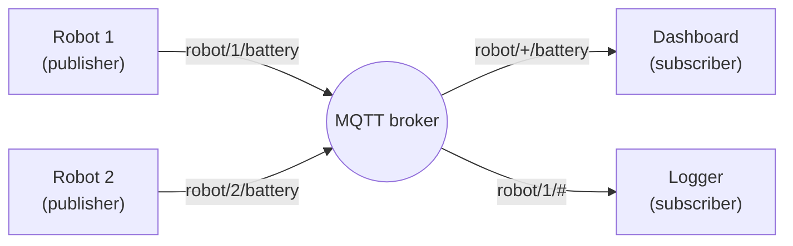

# MQTT & RPC

[Raw sockets](sockets.md) hand you a byte pipe and leave the conversation entirely up to you: who connects to whom, what a message means, how a request pairs with a reply. For many systems that is more plumbing than you want to write. **Higher-level messaging patterns** give you a ready-made conversation shape on top of sockets. Two dominate cyber-physical systems: **publish/subscribe** (MQTT) and **remote procedure calls** (gRPC, Thrift).

---

## MQTT: publish/subscribe for IoT

**MQTT** is a lightweight publish/subscribe messaging protocol designed for the Internet of Things — small devices, unreliable networks, minimal bandwidth. Its defining feature is a **central broker** that sits between everyone:

- **Publishers** send messages to a named **topic** (e.g. `robot/1/battery`). They do *not* know who, if anyone, is listening.
- **Subscribers** register interest in topics. They do *not* know who is publishing.
- The **broker** receives every published message and routes it to all current subscribers of that topic.



That indirection is the whole point: publishers and subscribers are **decoupled** — they never address each other, only topics. The benefits map directly onto robotics and IoT:

- **Low footprint and bandwidth** — ideal for a constrained device like a Raspberry Pi Zero ([Embedded Linux](../Chapter5/intro.md)).
- **Many-to-many** — several dashboards can watch the same robot, and one dashboard can watch many robots, with no extra work on the robot.
- **Reaches awkward networks** — a robot behind a firewall or on cellular cannot easily run a reachable server, but it *can* connect *outward* to a known broker; clients meet it there. You connect to a known hostname instead of chasing a robot's changing IP.

Topics are hierarchical and subscriptions can use wildcards — `robot/+/battery` matches every robot's battery topic, `robot/1/#` matches everything under robot 1. MQTT also offers three **quality-of-service** levels — 0 (at most once), 1 (at least once), 2 (exactly once) — trading delivery guarantees against overhead.

In code the pattern is small (conceptual API — needs a broker, so it will not run on Compiler Explorer):

<!-- no-ce -->
```cpp
// On the robot — publish a reading
client.connect("broker.local", 1883);
client.publish("robot/1/battery", "82");

// On the dashboard — subscribe and react
client.connect("broker.local", 1883);
client.subscribe("robot/+/battery");                 // "+" = any single level
client.onMessage([](const std::string& topic, const std::string& payload) {
    std::cout << topic << " = " << payload << "\n";
});
```

Run a broker like **Mosquitto**; on the C++ side use **Eclipse Paho** or `mqtt_cpp`. MQTT carries *messages* (which you still [serialize](serialization.md) — often as JSON), and because it is message-based it preserves boundaries for you, so no framing is needed.

---

## RPC: call a remote function like a local one

The other pattern inverts the model. A **Remote Procedure Call** framework lets you **call a function that executes on another machine as if it were a local function call** — the network, the [serialization](serialization.md), and the request/response pairing are all hidden. You think in terms of *what* the function does, not *how* the bytes move.

The workflow is the same for every RPC framework:

1. **Define an interface** in a language-neutral file — the methods, their arguments, their return types.
2. **Run a code generator** that turns that file into client and server code in your language(s).
3. **Implement** the server methods; **call** them from the client through the generated stub.

### gRPC

**gRPC** (from Google) is the modern default. It runs over **HTTP/2**, supports **streaming** (a call can return a stream of messages, not just one reply), and has idiomatic libraries in a dozen languages. Interfaces are defined in **`.proto`** files using [Protocol Buffers](serialization.md) — the binary serialization format — and the `protoc` compiler generates the code:

```proto
// robot.proto — the contract both ends share
service Robot {
    rpc GetStatus(StatusRequest) returns (StatusReply);
    rpc StreamPose(PoseRequest) returns (stream Pose);   // server-streaming RPC
}

message StatusRequest {}
message StatusReply { double battery = 1; bool armed = 2; }
```

From this, gRPC generates a `Robot` client you call like an object and a server base class you fill in. A Python dashboard and a C++ controller generated from the *same* `.proto` interoperate automatically — the contract is the single source of truth.

### Thrift

**Apache Thrift** is the older cross-platform RPC framework, conceptually the same: you write a `.thrift` IDL file, run the Thrift compiler, and get client/server code in any of many supported languages. Choosing between Thrift and gRPC mostly comes down to ecosystem and language support; **gRPC** is the more common modern choice, largely for its HTTP/2 streaming and momentum.

---

## Choosing a pattern

| Pattern | Shape | Best for |
|---------|-------|----------|
| **MQTT** (pub/sub) | Many-to-many via a broker, decoupled | Telemetry, events, IoT; many watchers; awkward networks |
| **RPC** (gRPC/Thrift) | Request/response with a typed contract | Calling operations on a service; "do X and tell me the result" |
| **Raw sockets** ([Networking](networking.md)) | A byte pipe you define | Simple/custom protocols, full control, minimal dependencies |
| **[Modbus](modbus.md)** | Register polling | Talking to industrial devices |

A useful way to decide: if you are **broadcasting state** that any number of consumers might want — sensor readings, status updates — reach for **MQTT**. If you are **invoking an operation** and want its result — "arm the robot", "compute a path" — reach for **RPC**. If you fully control both ends and the protocol is simple, raw sockets with a [serialization format](serialization.md) are perfectly fine and have the fewest moving parts.

!!! tip "Don't over-engineer the link"
    These frameworks earn their complexity at scale — many clients, many languages, evolving contracts. For a two-program course project where you write both ends, a plain [TCP socket](sockets.md) carrying [JSON](serialization.md) lines is often the right, honest choice. Reach for MQTT or gRPC when the decoupling or the typed contract genuinely buys you something.

---

## Summary

- Above raw sockets sit **messaging patterns** that supply a ready-made conversation shape: **publish/subscribe** (MQTT) and **remote procedure calls** (gRPC, Thrift).
- **MQTT** routes messages through a central **broker** by **topic**; publishers and subscribers are **decoupled**. It is lightweight, many-to-many, and reaches constrained or firewalled devices — ideal for IoT telemetry. Use Mosquitto + Paho; messages are still [serialized](serialization.md) (often JSON).
- **RPC** lets you **call a remote function like a local one**: define an interface, generate client/server code, implement and call. **gRPC** (HTTP/2, streaming, `.proto`/[Protocol Buffers](serialization.md)) is the modern default; **Thrift** is the older equivalent.
- Choose by intent: **MQTT** to broadcast state to many consumers, **RPC** to invoke an operation and get a result, **raw sockets + JSON** when you control both ends and want simplicity.
- This completes the data-communication toolkit — [serialization](serialization.md), [sockets](sockets.md), [networking libraries](networking.md), [serial](serial.md), [Modbus](modbus.md), and these patterns. Try the [exercises](exercises.md), then [Part 5](../Chapter5/intro.md) puts it all on a real embedded-Linux device.
