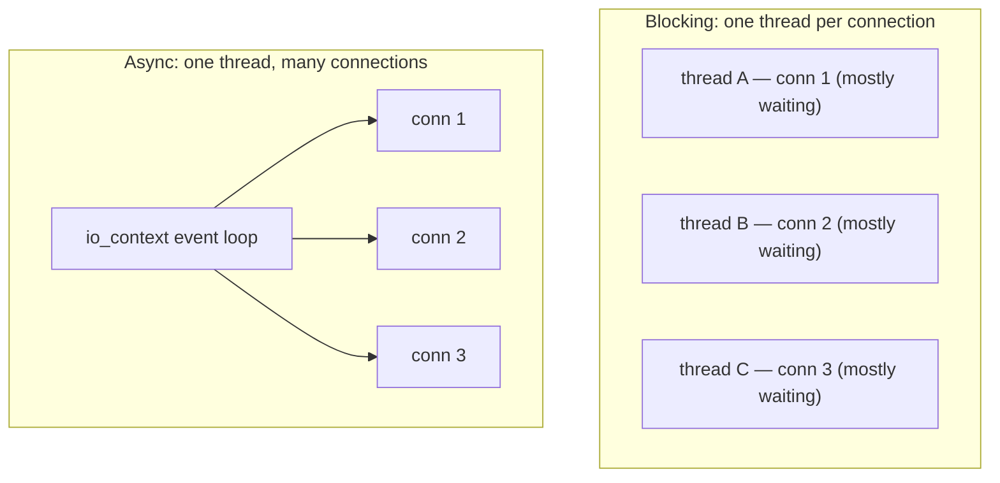

# Networking in C++

[Sockets](sockets.md) showed the raw POSIX API — `socket`, `bind`, `accept`, `send`, `recv` — and ended with a warning: it is verbose, error-prone, and *different* on Windows (Winsock2) versus Linux (`sys/socket`). Because the C++ standard library offers **no** networking, you have to bridge that gap with a library. This chapter surveys the ones this course uses and the one design decision they force on you: **blocking** or **asynchronous** I/O.

---

## Why a library at all

Re-read the raw echo server from [Sockets](sockets.md) and count the hazards: `reinterpret_cast` to `sockaddr*`, manual `htons`, a different header and a `WSAStartup` call on Windows, an `int` file descriptor you must remember to `close`, and no error handling. None of that is your program's logic — it is boilerplate the platform forces on you. A networking library wraps all of it behind a clean, cross-platform, RAII interface so you can write the part that matters.

Three libraries cover almost everything you will need:

| Library | What it is | Reach for it when |
|---------|-----------|-------------------|
| **Boost.Asio** | The de-facto C++ networking & async I/O library | Serious networking, especially asynchronous servers |
| **SimpleSocket** | A minimal cross-platform socket wrapper, no dependencies | Straightforward client/server work in course projects |
| **libcurl** | A battle-tested client for HTTP and many other protocols | Fetching from web URLs / talking to HTTP APIs |

---

## SimpleSocket: the small option

For most course work you do not need an industrial async framework — you need a TCP connection that works the same on Windows and the Pi without ceremony. [SimpleSocket](https://github.com/markaren/SimpleSocket) is a thin cross-platform wrapper around Win/Unix sockets with no third-party dependencies. The same code in [Sockets](sockets.md) shrinks to roughly this shape:

<!-- no-ce -->
```cpp
// Client — connect, send, receive, all cross-platform and RAII-managed
TCPClientContext ctx;
auto connection = ctx.connect("127.0.0.1", 8080);

connection->write("hello");

std::vector<unsigned char> buffer(1024);
auto n = connection->read(buffer);
// ... use the first n bytes ...
// connection closes itself when it goes out of scope (RAII)
```

No `WSAStartup`, no `reinterpret_cast`, no manual `close`, and identical source on every platform. It also bundles a [Modbus TCP](modbus.md) client, which is why the next chapters lean on it. For a robot streaming telemetry to a laptop, this is usually all you need.

---

## Boost.Asio: the serious option

[Boost.Asio](https://www.boost.org/doc/libs/release/doc/html/boost_asio.html) is the most widely used C++ networking library, and the basis of many others. It provides TCP, UDP, timers, and serial ports through one model built around an **`io_context`** — an object that owns the I/O and runs the event loop. Asio supports both styles of I/O, and that choice is the heart of this chapter.

### Blocking vs asynchronous I/O

A **blocking** (synchronous) call waits until it completes: `recv` does not return until data arrives. It is simple to reason about, but one thread can serve only one connection at a time — so handling many connections means **one thread per connection**, which (as [Thread Pools](../Chapter3/thread_pools.md) explained) does not scale to thousands.

An **asynchronous** call returns immediately; you say *what to do when the operation finishes*, and a single thread driving the `io_context` services many connections as their data arrives. No thread sits idle waiting.



Historically you expressed the "what to do next" as a **callback** (a handler function Asio calls on completion) — flexible, but nests into the "callback hell" [Futures & Promises](../Chapter3/futures.md) warned about. Modern Asio lets you instead use C++20 **[coroutines](../Chapter3/coroutines.md)**, so asynchronous code reads like straight-line blocking code while still never blocking a thread:

<!-- no-ce -->
```cpp
// Asio coroutine: suspends (without blocking the thread) at each co_await
awaitable<void> echo(tcp::socket socket) {
    char data[1024];
    for (;;) {
        std::size_t n = co_await socket.async_read_some(buffer(data));
        co_await async_write(socket, buffer(data, n));
    }
}
```

This is the payoff promised in the [Coroutines](../Chapter3/coroutines.md) chapter: one or a few threads can drive thousands of connections, each a suspended coroutine costing almost nothing while it waits — the scalable structure for a busy server, with readable code.

!!! tip "Match the model to the load"
    For a handful of connections, **blocking** I/O (with [SimpleSocket](https://github.com/markaren/SimpleSocket) or blocking Asio) is simplest and perfectly fine — a thread per connection is no problem at small scale. Reach for **asynchronous** Asio when you have many connections, or strict [latency](../Chapter3/real_time.md) goals that a thread-per-connection design cannot meet. Don't pay async's complexity tax before you need it.

---

## libcurl: when you just need HTTP

If the task is "fetch this URL" or "POST to this web API", you do not want raw sockets *or* Asio — you want **libcurl**, the library behind the `curl` command. It speaks HTTP/HTTPS (and much more), handles TLS, redirects, and authentication, and is available everywhere. Use it whenever your program is an HTTP *client* talking to a web service; reserve sockets and Asio for custom protocols and servers.

---

## Choosing

| Situation | Use |
|-----------|-----|
| A few TCP connections, course project | **SimpleSocket** (or blocking Asio) |
| Many connections / async / low latency | **Boost.Asio** (coroutines or callbacks) |
| HTTP client, talking to a web API | **libcurl** |
| Industrial device speaking Modbus | [Modbus](modbus.md) library (SimpleSocket has one) |
| Publish/subscribe or remote calls | [MQTT / RPC](mqtt_rpc.md) library |

Whatever you pick, install it through [vcpkg](../Chapter6/dependencies.md) rather than by hand — `vcpkg install boost-asio` / `curl` — so the dependency is reproducible.

---

## Summary

- C++ has **no standard networking**, and the raw OS APIs are verbose and platform-specific — so you use a library that wraps them with a clean, cross-platform, RAII interface.
- **SimpleSocket** is a dependency-free wrapper good for straightforward course client/server work (and it includes [Modbus TCP](modbus.md)); **Boost.Asio** is the serious, full-featured choice; **libcurl** is for HTTP clients.
- The core decision is **blocking vs asynchronous** I/O: blocking is simple but needs **one thread per connection**; asynchronous (Asio's `io_context`) lets **one thread serve many** connections. Modern Asio uses C++20 [coroutines](../Chapter3/coroutines.md) so async code reads like blocking code.
- Use blocking I/O at small scale; reach for async only when connection count or [latency](../Chapter3/real_time.md) demands it.
- Install networking libraries via [vcpkg](../Chapter6/dependencies.md). Next: [Serial Communication](serial.md), for the wire to a microcontroller.
