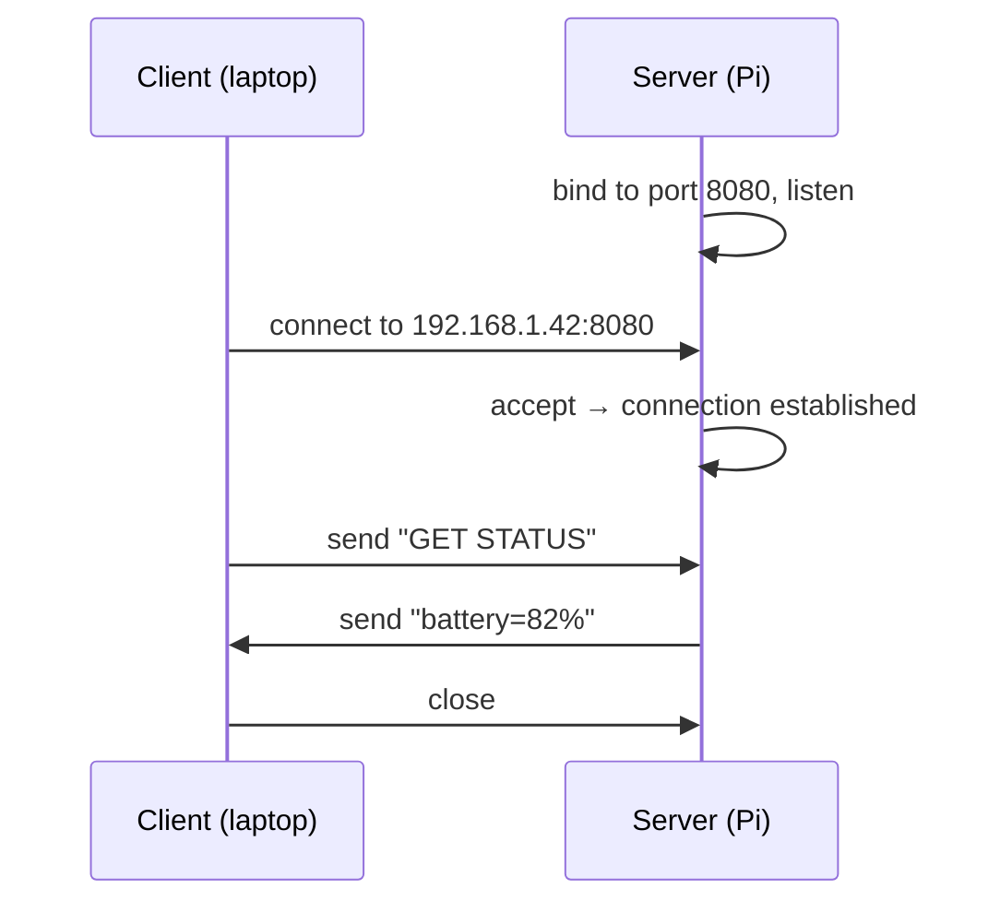

# Sockets, TCP & UDP

[Part 2](../Chapter2/processes_threads.md) let threads inside one process share memory. But a cyber-physical system is spread across *machines*: a sensor node, a controller on a Raspberry Pi, an operator's laptop. They have no shared memory — the Pi cannot read the laptop's variables. They communicate by sending **bytes over a network**, and the abstraction that lets them do so is the **socket**.

This chapter explains what a socket is, the client/server model built on top of it, and the choice that shapes every networked program you write: **TCP or UDP**.

---

## What is a socket?

A **socket** is one endpoint of a two-way communication link between two programs. Once a connection is open, a program writes bytes into its socket and reads bytes out of it, much as it writes to and reads from a file. The operating system carries the bytes across the network to the socket on the other end.

A socket is identified by two things together:

- an **IP address** — which machine on the network (e.g. `192.168.1.42`, or `127.0.0.1` for "this same machine"),
- a **port number** — which program on that machine (e.g. `8080`).

The pair is a **socket address**. The analogy that sticks: the IP address is the street address of a building, and the port is the apartment number inside it. A packet needs both to reach the right program.

| Term | Meaning |
|------|---------|
| **IP address** | Identifies a host on the network. `127.0.0.1` / `localhost` is the **loopback** — your own machine, useful for testing a client and server on one computer. |
| **Port** | A 16-bit number (0–65535) identifying one program on a host. Ports below 1024 are *privileged* (e.g. 80 = HTTP, 22 = SSH). Pick something high (e.g. 8080) for your own programs. |
| **Socket** | The endpoint object your program reads and writes through. |

---

## The client/server model

Most networked programs split into two roles:

- A **server** starts first, claims a port, and **waits** for connections. It is passive — it reacts to whoever connects.
- A **client** knows the server's address and port, and **initiates** the connection. It is active — it reaches out.

A robot's telemetry service is a server; the operator's dashboard is a client that connects to it. Once connected, the link is two-way — both can send and receive — but the *roles during setup* are asymmetric.



The sequence of system calls follows those roles. The names below are the **POSIX** sockets API — the foundation every networking library is built on:

| Server | Client | Purpose |
|--------|--------|---------|
| `socket()` | `socket()` | Create the endpoint. |
| `bind()` | — | Claim a specific port on this host. |
| `listen()` | — | Mark the socket as accepting connections. |
| `accept()` | — | Block until a client connects; return a new socket for that client. |
| — | `connect()` | Reach out to the server's address and port. |
| `send()` / `recv()` | `send()` / `recv()` | Exchange bytes once connected. |
| `close()` | `close()` | Tear the connection down. |

!!! note "C++ has no sockets in its standard library"
    Unlike Python or Java, the C++ standard library offers **no** networking. You either call the OS API directly — `sys/socket.h` on Linux, **Winsock2** on Windows, and they differ — or, far better, use a cross-platform library that wraps them. The [next chapter](networking.md) covers the libraries this course uses (Boost.Asio and a lightweight wrapper). The raw API below is shown so you understand what those libraries are doing for you, not because you should write it by hand.

---

## TCP vs UDP: the fundamental choice

Two programs can talk over one of two transport protocols, and choosing between them is the first design decision of any networked feature.

**TCP** (Transmission Control Protocol) is a **reliable, ordered, connection-oriented byte stream.** It guarantees that every byte you send arrives, exactly once, in the order you sent it — retransmitting anything lost along the way. You open a connection, and from then on it behaves like a two-way pipe.

**UDP** (User Datagram Protocol) sends **independent datagrams with no guarantees.** A datagram may arrive, may not, and several may arrive out of order. There is no connection — you just fire a packet at an address. In exchange for dropping the guarantees, UDP has far less overhead and lower latency.

| | TCP | UDP |
|---|---|---|
| Connection | Connection-oriented (handshake first) | Connectionless (just send) |
| Reliability | Guaranteed delivery, retransmits losses | No guarantee; packets can vanish |
| Ordering | In-order | May arrive out of order |
| Shape of data | Continuous byte stream | Discrete datagrams (messages) |
| Header overhead | Larger (~20 bytes) | Smaller (8 bytes) |
| Speed / latency | Slower; more overhead | Faster; minimal overhead |
| Typical use | Web (HTTP), file transfer, [Modbus TCP](modbus.md), command/control | Live video, telemetry streams, VoIP, gaming |

The rule of thumb:

- Choose **TCP** when **every message must arrive correctly** — sending a command to a robot, transferring a config file, anything where a lost or reordered message is a bug. Most of this course uses TCP.
- Choose **UDP** when **fresh-but-occasionally-lost beats complete-but-late** — a 100 Hz stream of pose estimates, where a dropped sample barely matters because another arrives in 10 ms, and you never want to wait for a retransmit of stale data.

!!! warning "TCP is a stream, not a message queue"
    A common beginner bug: TCP does **not** preserve your `send()` boundaries. Two `send()`s of 10 bytes may arrive as one `recv()` of 20, or as 5 + 15. TCP guarantees the *bytes* and their *order*, not where one message ends and the next begins. You must impose your own framing — a length prefix, or a delimiter like `\n`. This is one reason a [serialization](serialization.md) format matters. UDP, by contrast, preserves datagram boundaries: one `send()` is one `recv()`.

---

## A minimal TCP server and client

To make the lifecycle concrete, here is an **echo** service using the raw POSIX API on Linux: the server accepts one client and sends back whatever it receives. This is deliberately stripped of error handling to show the shape; real code checks every return value, and you would normally use a library instead. It will not run on Compiler Explorer (no network), but it runs on Linux and the Pi.

**Server:**

<!-- no-ce -->
```cpp
#include <arpa/inet.h>
#include <unistd.h>
#include <cstring>
#include <iostream>

int main() {
    int server = socket(AF_INET, SOCK_STREAM, 0);   // SOCK_STREAM = TCP

    sockaddr_in addr{};
    addr.sin_family = AF_INET;
    addr.sin_addr.s_addr = INADDR_ANY;               // accept on any interface
    addr.sin_port = htons(8080);                     // port 8080, network byte order

    bind(server, reinterpret_cast<sockaddr*>(&addr), sizeof(addr));
    listen(server, 1);                               // queue up to 1 pending connection
    std::cout << "listening on port 8080...\n";

    int client = accept(server, nullptr, nullptr);   // blocks until someone connects

    char buffer[1024];
    ssize_t n = recv(client, buffer, sizeof(buffer), 0);
    send(client, buffer, n, 0);                      // echo the bytes straight back

    close(client);
    close(server);
}
```

**Client:**

<!-- no-ce -->
```cpp
#include <arpa/inet.h>
#include <unistd.h>
#include <cstring>
#include <iostream>

int main() {
    int sock = socket(AF_INET, SOCK_STREAM, 0);

    sockaddr_in addr{};
    addr.sin_family = AF_INET;
    addr.sin_port = htons(8080);
    inet_pton(AF_INET, "127.0.0.1", &addr.sin_addr);  // connect to localhost

    connect(sock, reinterpret_cast<sockaddr*>(&addr), sizeof(addr));

    const char* message = "hello";
    send(sock, message, std::strlen(message), 0);

    char buffer[1024];
    ssize_t n = recv(sock, buffer, sizeof(buffer), 0);
    std::cout << "server replied: " << std::string(buffer, n) << "\n";

    close(sock);
}
```

Start the server in one terminal, run the client in another, and the client prints `server replied: hello`. Note the recurring details that libraries exist to hide: `htons` to put the port in **network byte order** (big-endian — the agreed order on the wire, see [Serialization](serialization.md)), the `reinterpret_cast` to the generic `sockaddr*`, and the fact that on Windows none of these headers exist and you would include `<winsock2.h>` and call `WSAStartup` first. Writing this by hand, portably, is exactly the chore [Networking in C++](networking.md) removes.

---

## Where this is going

Raw sockets move *bytes*. But your program thinks in *objects* — a sensor reading, a command, a pose. Two jobs sit between the two:

1. **Serialization** turns an object into a well-defined sequence of bytes and back, so both ends agree on the meaning. That is the [next-but-one chapter](serialization.md).
2. A **networking library** removes the boilerplate above and adds asynchronous I/O so one thread can service many connections. That is [Networking in C++](networking.md).

On top of those, higher-level protocols give you ready-made conversation patterns: [Modbus](modbus.md) for industrial devices, and [MQTT and RPC](mqtt_rpc.md) for publish/subscribe and remote calls.

---

## Summary

- A **socket** is a read/write endpoint for network communication, identified by an **IP address** (which machine) plus a **port** (which program). `127.0.0.1` / `localhost` is the loopback to your own machine.
- In the **client/server model** the server `bind`s a port and waits (`listen`/`accept`); the client `connect`s to it. After setup the link is two-way.
- **TCP** is a reliable, ordered, connection-oriented byte stream — use it when every message must arrive. **UDP** is connectionless datagrams with no guarantees — use it when low latency matters more than the occasional lost packet.
- TCP does **not** preserve message boundaries; you must frame messages yourself (length prefix or delimiter).
- C++ has **no standard sockets**. The raw POSIX/Winsock API is verbose and platform-specific, which is why this course uses a [library](networking.md) and a [serialization format](serialization.md) on top.
