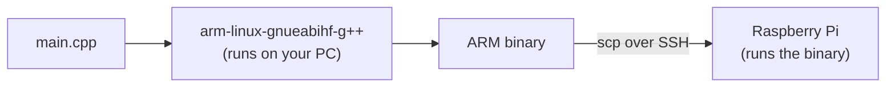

# Cross-Compiling for the Pi

A Raspberry Pi runs the same C++ and the same standard library as your laptop, so in principle you can copy your source onto the Pi and run `cmake` there. In practice that is painfully slow — a Pi Zero compiling a project with a few dependencies can take many minutes, sometimes long enough to run out of memory and fail. The professional answer is **cross-compilation**: build the Pi's binary on your fast PC, then copy the finished executable across.

This chapter explains what cross-compilation is, how to set it up with a CMake toolchain file, and when to reach for the simpler alternatives instead.

---

## Host, target, and toolchain

Three words make the rest of this chapter readable.

| Term | Meaning |
|------|---------|
| **Host** | The machine you compile *on* — your `x86-64` laptop. |
| **Target** | The machine the program will *run on* — the `ARM` Raspberry Pi. |
| **Toolchain** | The set of tools (compiler, linker, libraries) that produce code for the target. |

When host and target are the same — compiling on your laptop *for* your laptop — that is ordinary **native** compilation, the only kind AIS1003 needed. **Cross-compilation** is when they differ: an `x86-64` host producing an `ARM` binary. Because a normal `g++` only emits code for its own architecture, you need a special compiler — a **cross-compiler** — that runs on `x86-64` but emits `ARM` machine code.



The reason a binary is not portable is the lesson from AIS1003's [Portability](../portability.md) chapter made physical: compiled code is machine code for **one** instruction set. An `x86-64` executable simply has no meaning to the Pi's ARM CPU, and vice versa.

---

## Installing a cross-compiler

On a Debian/Ubuntu host (including WSL2), the cross-compilers are a package away. Which one depends on the Pi's OS:

```bash
# 64-bit Raspberry Pi OS (Pi 3/4/5, Pi Zero 2 W) — the common case today
sudo apt install g++-aarch64-linux-gnu

# 32-bit Raspberry Pi OS (older images, original Pi Zero)
sudo apt install g++-arm-linux-gnueabihf
```

This gives you a compiler named `aarch64-linux-gnu-g++` (or `arm-linux-gnueabihf-g++`) that runs on your PC and emits Pi code. Check the Pi's architecture with `uname -m` on the Pi itself: `aarch64` means 64-bit, `armv7l` or `armv6l` means 32-bit. Picking the wrong one produces a binary the Pi refuses to run with a confusing `Exec format error`.

!!! warning "Match the target, or it won't run"
    The binary's architecture **and** its C/C++ library version must be compatible with what the Pi has. A 64-bit cross-compiler for a 32-bit Pi, or a binary built against a much newer glibc than the Pi's OS ships, will fail at load time. When in doubt, check `uname -m` and the OS version on the actual device.

---

## Telling CMake to cross-compile

You do **not** hard-code the cross-compiler into your `CMakeLists.txt` — that would tie the project to one machine. Instead you write a small **toolchain file** that describes the target, and pass it to CMake at configure time. The project itself stays unchanged and still builds natively when you ask it to.

A minimal toolchain file for a 64-bit Pi, `pi.cmake`:

```cmake
# pi.cmake — describes the Raspberry Pi target
set(CMAKE_SYSTEM_NAME Linux)
set(CMAKE_SYSTEM_PROCESSOR aarch64)

set(CMAKE_C_COMPILER   aarch64-linux-gnu-gcc)
set(CMAKE_CXX_COMPILER aarch64-linux-gnu-g++)

# Look for target libraries/headers under the sysroot, but find host
# programs (like helper tools) on the host.
set(CMAKE_FIND_ROOT_PATH_MODE_PROGRAM NEVER)
set(CMAKE_FIND_ROOT_PATH_MODE_LIBRARY ONLY)
set(CMAKE_FIND_ROOT_PATH_MODE_INCLUDE ONLY)
```

Setting `CMAKE_SYSTEM_NAME` is what flips CMake into cross-compiling mode. Configure and build by pointing CMake at the file:

```bash
cmake -S . -B build-pi -DCMAKE_TOOLCHAIN_FILE=pi.cmake
cmake --build build-pi
```

The result in `build-pi/` is an ARM binary. Confirm it with `file`:

```bash
$ file build-pi/app
build-pi/app: ELF 64-bit LSB executable, ARM aarch64, ...
```

`ARM aarch64` rather than `x86-64` means the cross-compile worked. Copy it to the Pi and run it there — covered in [Deploying & systemd](deploy.md).

---

## The sysroot problem

A self-contained program that uses only the standard library cross-compiles with nothing more than the above. The moment you link a **third-party library** — say Boost.Asio for [networking](../Chapter4/networking.md) — the cross-compiler needs the *ARM* build of that library and its headers, not your PC's `x86-64` copies.

The clean solution is a **sysroot**: a copy of the Pi's relevant `/usr` and `/lib` directories on your PC, which you point the toolchain file at with `CMAKE_SYSROOT`. You populate it by copying those directories off a real Pi (`rsync` over SSH is the usual route). Setting up a full sysroot is more than a first project needs, so this book flags it as the next step rather than walking through it; for self-contained binaries you can skip it entirely.

!!! tip "Keep the first project dependency-free"
    Your first cross-compiled program should use only the standard library — including `<thread>`, which needs no sysroot. That gets you the whole edit-build-deploy loop working before you take on the extra complexity of cross-compiling dependencies.

---

## The simpler alternatives

Cross-compilation is the fastest loop, but it is not the only one, and for a first project a simpler approach may be all you need.

| Approach | How | When it's the right call |
|----------|-----|--------------------------|
| **Cross-compile** | Toolchain file on your PC (this chapter) | Big projects, slow Pis, frequent rebuilds — the fastest loop. |
| **Compile on the Pi** | `git clone` and `cmake` on the device | Small programs; a one-off; when you want zero host setup. |
| **Remote build via CLion** | Point CLion at the Pi over SSH; it builds *on* the Pi but you edit on your laptop | A good middle ground — full IDE, no toolchain file, but limited by the Pi's speed. |

A reasonable progression: start by **compiling on the Pi** to prove your program works on the target at all, move to **CLion remote** for comfortable editing and debugging, and graduate to a **cross-compile toolchain** once the Pi's compile times become the bottleneck.

!!! note "CLion can do all three"
    Through **Settings → Build, Execution, Deployment → Toolchains**, CLion supports a remote SSH toolchain (build on the Pi) and a custom toolchain pointed at your cross-compiler (build on the PC). [Getting Started](../getting_started.md) introduced these; the choice is about speed versus setup, not capability.

---

## Summary

- A Pi runs the same C++ as your PC, but compiling **on** the Pi is slow. **Cross-compiling** builds the ARM binary on your fast PC instead.
- The **host** is what you build on, the **target** is what you run on; a **cross-compiler** runs on the host and emits code for the target. Compiled code is architecture-specific — an `x86-64` binary cannot run on ARM.
- Install `g++-aarch64-linux-gnu` (64-bit Pi) or `g++-arm-linux-gnueabihf` (32-bit Pi); check the Pi's `uname -m` to choose correctly.
- Describe the target in a **CMake toolchain file** and pass it with `-DCMAKE_TOOLCHAIN_FILE=`. Setting `CMAKE_SYSTEM_NAME` switches CMake into cross-compile mode; your `CMakeLists.txt` stays unchanged. Verify the output with `file`.
- Linking third-party libraries cross-platform needs a **sysroot** (a copy of the Pi's libraries); keep your first project dependency-free to avoid it.
- For small jobs, **compiling on the Pi** or a **CLion remote SSH** build are simpler; reach for cross-compilation when rebuild speed starts to hurt. Next: [Deploying & systemd](deploy.md) gets the binary onto the Pi and running as a service.
