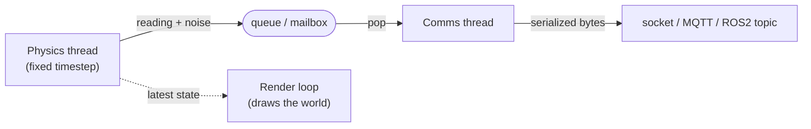

# Virtual Environments

Testing a robot's perception and control in the real world is slow, expensive, and sometimes dangerous — you cannot crash a real car a thousand times to tune a controller. A **virtual environment** simulates the world in software, so you can develop and test algorithms before deploying them, and generate **synthetic training data** for the [vision models](deep_vision.md) of the previous chapters. This page is about the specific simulator this course's project is built on — **[threepp](https://github.com/markaren/threepp)** — and how everything you have learned so far snaps into it.

---

## Why simulate

A virtual environment buys you three things:

- **Safe, fast iteration.** Test a control loop or a perception pipeline against a simulated car — no hardware, no risk, and far faster than real time if you want.
- **A repeatable test suite.** A simulated scene runs identically every time, so a regression test for your [control](../Chapter3/real_time.md) or vision code is possible in a way the messy real world never allows.
- **Synthetic data.** Render labelled images of objects in varied poses and lighting to *train* a model when real labelled data is scarce — the labels come for free because the simulator knows exactly what it drew.

The pattern is a loop: develop against the **virtual world**, then deploy the *same* control and vision code to the **real world** ([ROS2](../Chapter7/ros2_concepts.md), Part 7).

!!! tip "Match fidelity to purpose"
    Do not reach for photo-realism by default. Testing whether a state machine or a control loop behaves correctly needs only a **coarse** world — simple shapes, basic rasterization — which is quick to build and fast to run. Save ray tracing and physics engines for when you specifically need **realistic sensor data** (e.g. synthetic images that must fool a vision model trained on real photos). The right simulation is the *simplest* one that exercises what you are testing. Heavy engines like **NVIDIA Omniverse** or **Unreal Engine** give photo-realism and integrated physics, but they are a lot of world to carry when a few boxes would do.

---

## threepp in one paragraph

**threepp** is a C++ port of the popular JavaScript library **three.js**, written by this course's instructor. It is a **scene graph** renderer: everything visible is an `Object3D`, and objects nest into a tree (a car is a `Group` holding wheel meshes, a sensor mount, a camera). You build the tree, hand it to a renderer, and it draws. The API mirrors three.js but is idiomatic modern C++: most objects are held by `shared_ptr` and made through a static `::create()` factory (`Mesh::create(...)`, `Scene::create()`), while small maths types (`Vector3`, `Color`) are plain value types. You consume it with the [`FetchContent`](../Chapter5/cmake.md) pattern from Part 5 — no separate install, CMake pulls and builds it:

```cmake
include(FetchContent)
set(THREEPP_BUILD_TESTS OFF)
set(THREEPP_BUILD_EXAMPLES OFF)
FetchContent_Declare(
    threepp
    GIT_REPOSITORY https://github.com/markaren/threepp.git
    GIT_TAG        <a-commit-or-tag>
    GIT_SHALLOW    TRUE)
FetchContent_MakeAvailable(threepp)

target_link_libraries(simulator PUBLIC threepp::threepp)
```

A minimal scene shows the shape of the API — a `Canvas` (the window), a `GLRenderer`, a `Scene`, a camera, and meshes made with `::create()`:

<!-- no-ce -->
```cpp
#include "threepp/threepp.hpp"
using namespace threepp;

int main() {
    Canvas canvas{"Simulator"};
    GLRenderer renderer{canvas};

    auto scene  = Scene::create();
    auto camera = PerspectiveCamera::create(75, canvas.aspect(), 0.1f, 100.f);
    camera->position.z = 5;

    auto geometry = BoxGeometry::create();
    auto material = MeshPhongMaterial::create();
    auto car = Mesh::create(geometry, material);   // shared_ptr<Mesh>
    scene->add(car);                               // into the scene graph

    canvas.animate([&] {                           // the render loop (see below)
        renderer.render(*scene, *camera);
    });
}
```

---

## The simulation loop: physics vs render

The last line above is the important one. `canvas.animate(...)` **is the render loop** — it takes a `std::function` callback ([Part 1](../Chapter1/lambdas.md)) and calls it once per frame, forever, until the window closes. This inverts the control you are used to: you do not write the loop, **the render loop owns you** — you hand it a callback and the framework decides when to run it. Everything your simulation does per frame happens inside that lambda.

But rendering and *physics* want to run at different rates, and for a good reason:

- **The render rate is whatever the display and GPU manage** — 60 fps, sometimes less, and it varies frame to frame.
- **The physics step should be a fixed timestep.** Integrating motion (position += velocity × dt) with a *variable* dt makes the simulation non-deterministic and unstable — the same inputs produce different results depending on frame rate. A **fixed dt** (say 1/240 s) keeps the physics repeatable and stable.

So you decouple them. The render callback measures how much wall-clock time has passed and steps the physics in fixed increments to catch up:

<!-- no-ce -->
```cpp
const double dt = 1.0 / 240.0;     // fixed physics timestep
double accumulator = 0.0;
Clock clock;

canvas.animate([&] {
    accumulator += clock.getDelta();          // real time since last frame
    while (accumulator >= dt) {
        stepPhysics(dt);                       // advance the world by a FIXED dt
        accumulator -= dt;
    }
    renderer.render(*scene, *camera);          // draw whenever the frame is ready
});
```

That `while`-until-caught-up is **exactly** the rolling-deadline pattern from [Real-Time & Timing](../Chapter3/real_time.md): a periodic task that must run at a fixed rate without drifting. The physics loop is the same idea — advance in fixed steps, absorb overshoot rather than accumulate it — and if a step ever overruns, you notice the accumulator growing, just as the real-time chapter's overrun detection does.

!!! note "Where does the physics run?"
    In the sketch above physics runs *inside* the render callback — simplest, and fine while a step is cheap. If a physics step gets heavy enough to stall rendering, move it to its **own thread** at a fixed rate ([`sleep_until` a rolling deadline](../Chapter3/real_time.md)), and let the render thread read the latest state. That is a producer/consumer across a thread boundary — the [shared-data](../Chapter2/sharing_data.md) rules from Part 2 apply, and a lock or an [atomic](../Chapter2/atomics.md) snapshot guards the hand-off.

---

## Simulated sensors

Here is the idea that ties the whole book together. **A simulated sensor is just code that reads the simulator's state, adds noise, and produces the same bytes a real sensor would.** A simulated wheel-encoder reads the car's angular velocity from the physics state; a simulated lidar casts rays into the scene graph and returns distances; a simulated GPS reads the car's position and perturbs it. None of this is special — it is ordinary code reading state you already have.

The point is that **downstream code cannot tell the difference**. Your simulated lidar emits a distance reading, [serialized](../Chapter4/serialization.md) into exactly the bytes Part 4 carries — over a [socket](../Chapter4/sockets.md), an [MQTT topic](../Chapter4/mqtt_rpc.md), or (in Part 7) a [ROS2 topic](../Chapter7/ros2_concepts.md). The consumer parses bytes; it neither knows nor cares that a simulator produced them. That is what makes the develop-in-sim, deploy-to-hardware loop work: swap the sensor's *source* (physics state → real hardware) and nothing downstream changes.

Between the physics thread producing readings and the comms layer sending them sits the **queue / mailbox** pattern from [Part 2](../Chapter2/condition_variables.md): the physics thread pushes a reading, a comms thread pops it and sends. The queue decouples the two rates — physics can run at 240 Hz while telemetry sends at 20 Hz — and keeps the physics loop off any blocking I/O ([the hot-path discipline](../Chapter3/real_time.md) from the real-time chapter).



---

## Where control code plugs in

Your control code is the same code whether the car is simulated or real. It **reads sensor readings** (off the queue, or off a socket) and **writes actuator commands** (a steering angle, a wheel torque). In simulation, an actuator command is just an input to the physics step — the physics reads your commanded torque and integrates the car's motion accordingly:

<!-- no-ce -->
```cpp
// The control loop — unchanged between sim and hardware.
double steer = controller.update(latestSensorReading);   // your logic
car.setSteeringCommand(steer);                            // sim: an input to stepPhysics()
                                                          // real: a byte on a serial/CAN link
```

Conceptually the simulator closes the loop: **physics → sensor → (queue) → control → actuator command → physics.** The control code sits in the middle and never learns whether the world on either side is real. Build and tune it against the simulator; deploy the *same* code, pointed at real sensors and actuators over [ROS2](../Chapter7/ros2_concepts.md), to the car.

---

## Summary

- A **virtual environment** lets you develop and test control and perception **safely and repeatably** before touching hardware, and generates **synthetic, automatically-labelled** training data. **Match fidelity to purpose** — the simplest world that exercises your code is the right one.
- **threepp** is a C++ port of three.js by the course instructor: a **scene-graph** renderer (`Object3D` hierarchy), objects made via `::create()` and held by `shared_ptr`, consumed through CMake **`FetchContent`**.
- The **render loop owns you** — `canvas.animate(cb)` calls your `std::function` every frame. Run **physics on a fixed timestep** decoupled from the variable render rate; the catch-up loop is the [real-time rolling-deadline pattern](../Chapter3/real_time.md).
- A **simulated sensor** reads physics state + noise and emits the *same bytes* Part 4 carries; a [queue/mailbox](../Chapter2/condition_variables.md) sits between the physics thread and the comms thread.
- **Control code is identical** in sim and on hardware — it reads readings and writes commands; only the source and sink change. Next: the [exercises](exercises.md), then [Part 7](../Chapter7/ros2_concepts.md) connects the simulator to a real robot middleware.
