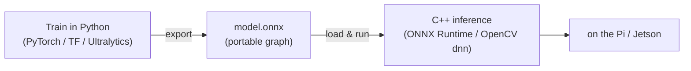

# Model Deployment & ONNX

You have a trained model — built in Python, as [Deep Vision](deep_vision.md) explained. Now it has to run **on the robot**: in C++, in a real-time loop, next to your control and [communication](../Chapter4/serialization.md) code, on a Raspberry Pi with no Python framework installed. This chapter is where computer vision rejoins the rest of the book — the bridge is a portable model format called **ONNX**, and the payoff is a threaded vision pipeline built from the [Part 2](../Chapter2/condition_variables.md)/[Part 3](../Chapter3/real_time.md) tools you already have.

---

## The deployment problem

A model trained in PyTorch or TensorFlow lives in that framework's own format and needs that framework (plus Python, plus its dependencies) to run. That is fine on a training PC and wrong for a robot: you do not want to install PyTorch on a Pi Zero, and you do not want your real-time C++ loop calling into a Python interpreter. You need to **detach the model from its training framework** and run it from C++.

## ONNX: a portable model

**ONNX** (Open Neural Network Exchange) is an open, framework-agnostic format for machine-learning models. A model is stored as a **directed graph of operations** (convolution, ReLU, …) with their weights — independent of the framework that produced it. The workflow is always the same three steps:



1. **Train** in Python.
2. **Export** the trained model to a `.onnx` file (`torch.onnx.export`, or for YOLO, Ultralytics' `export(format="onnx")`).
3. **Load and run** it from C++ with a runtime that reads ONNX.

Why this format rather than shipping the framework:

| Benefit | What it gives you |
|---------|-------------------|
| **Interoperability** | Train in PyTorch, run in C++ — or any framework/language with an ONNX runtime |
| **Optimised inference** | ONNX Runtime applies graph optimisations and uses hardware accelerators |
| **Portability** | One `.onnx` file runs across platforms without the training stack |
| **Standardisation** | A fixed operator set, so the model means the same thing everywhere |

Two runtimes matter in C++: **OpenCV's `dnn` module** (you already link [OpenCV](opencv.md), and it reads ONNX directly — simplest for this course) and **ONNX Runtime** (Microsoft's dedicated, highly optimised engine). For acceleration, ONNX Runtime targets backends like **TensorRT** (NVIDIA Jetson) and **OpenVINO** (Intel) — per Ultralytics, exporting can yield roughly a 3× CPU speedup with ONNX/OpenVINO and up to ~5× on GPU with TensorRT versus the raw framework.

---

## Running inference in C++

With OpenCV's `dnn` module, loading and running an ONNX model is a few lines (needs OpenCV, so not runnable here):

<!-- no-ce -->
```cpp
#include <opencv2/dnn.hpp>
#include <opencv2/opencv.hpp>

cv::dnn::Net net = cv::dnn::readNetFromONNX("yolo.onnx");   // load the portable model

cv::Mat detect(cv::dnn::Net& net, const cv::Mat& frame) {
    // Pre-process: resize to the model's input size, scale to 0..1, BGR→RGB, NCHW layout
    cv::Mat blob = cv::dnn::blobFromImage(
        frame, 1.0 / 255.0, cv::Size(640, 640), cv::Scalar(), /*swapRB=*/true);

    net.setInput(blob);
    return net.forward();                  // run the network → raw detections
}
```

Three things to get right when deploying a model, all from the export side:

- **Input size** (`imgsz`, e.g. 640×640) must match what the model was exported for — the lecture's export parameters exist for exactly this.
- **Pre-processing must mirror training**: the same scaling (often `1/255`), the same channel order (models usually want RGB, so `swapRB=true` because OpenCV is [BGR](opencv.md)), the same layout.
- **Post-processing** parses the raw output tensor into boxes, scores, and class IDs, then applies *non-maximum suppression* (`cv::dnn::NMSBoxes`) to remove overlapping duplicate boxes.

Get the pre/post-processing wrong and the model runs but returns nonsense — the most common deployment bug, and why matching the export configuration matters.

---

## A real-time vision pipeline

Inference takes time — tens of milliseconds per frame, sometimes more on a Pi. If you run capture and inference in one loop, a slow frame stalls everything, and "[late is wrong](../Chapter3/real_time.md)" for the control system waiting on the result. The fix is the structure from Parts 2 and 3: **separate threads** connected by a [thread-safe queue](../Chapter2/condition_variables.md), so capture, inference, and action proceed concurrently.

<!-- no-ce -->
```cpp
#include <atomic>
#include <opencv2/opencv.hpp>
#include <thread>
// ThreadSafeQueue<T> from the Templates chapter (mutex + condition_variable)

std::atomic<bool> running{true};
ThreadSafeQueue<cv::Mat> frames;

// Producer: grab frames as fast as the camera delivers them
std::jthread capture([&] {
    cv::VideoCapture camera(0);
    cv::Mat frame;
    while (running && camera.read(frame)) {
        frames.push(frame.clone());        // hand a copy to the pipeline
    }
});

// Consumer: run the model on each frame, then act on the result
std::jthread inference([&] {
    cv::dnn::Net net = cv::dnn::readNetFromONNX("yolo.onnx");
    while (running) {
        cv::Mat frame = frames.waitAndPop();   // sleeps until a frame arrives
        cv::Mat output = detect(net, frame);
        // ... parse detections, then send them over a socket / feed the controller ...
    }
});
```

This is the [producer/consumer](../Chapter2/condition_variables.md) pattern with a vision payload: the camera thread never blocks on inference, and the detections flow out to the [controller](../Chapter3/real_time.md) or across a [socket](../Chapter4/sockets.md) to an operator. It composes the whole book — a [generic queue](../Chapter1/templates.md), [`jthread`](../Chapter2/threads.md), [atomics](../Chapter2/atomics.md) for the stop flag, and the [serialization](../Chapter4/serialization.md) of results.

!!! warning "Drop frames to stay real-time"
    If inference is slower than capture, an unbounded queue **grows without limit** and your detections fall further and further behind the live scene — the [drift](../Chapter3/real_time.md) problem, in spatial form. For a real-time system you almost always want the **latest** frame, not a backlog of stale ones: cap the queue at a small size and discard the oldest frame when it is full (or keep only a single "latest frame" slot). A fresh detection on the current frame beats a perfect detection on a frame from two seconds ago.

---

## On the device

The same pipeline runs whether its frames come from the [simulator](virtual_environments.md) on your PC or from a camera on a real device — the C++ is identical. On hardware, performance is the constraint: a Raspberry Pi CPU runs small models at only a few frames per second, so you choose a lightweight model (a small YOLO variant) and a modest input size, or offload inference to a more capable machine over the network. A Jetson (GPU + TensorRT) sits between a Pi and a desktop for on-board deep vision at speed. Deploying to a real board is background this year — see the [Embedded Linux](../embedded_linux.md) reference.

---

## Summary

- A model trained in a Python framework must be **detached from that framework** to run on the robot. **ONNX** is the portable, framework-agnostic format that makes this possible: **train in Python → export to `.onnx` → run in C++**.
- ONNX gives **interoperability, optimised inference, and portability**; run it in C++ with **OpenCV's `dnn` module** (simplest — you already link OpenCV) or **ONNX Runtime** (with TensorRT/OpenVINO acceleration).
- Inference correctness hinges on **matching the export configuration**: input size, pre-processing (scale, `swapRB` for [BGR→RGB](opencv.md)), and post-processing (parse output + non-maximum suppression).
- Run capture and inference on **separate threads** joined by a [thread-safe queue](../Chapter2/condition_variables.md) so vision never stalls control — and **drop stale frames** to stay [real-time](../Chapter3/real_time.md).
- The same pipeline runs against the [simulator](virtual_environments.md) or a real device; on hardware, size the model to the device or offload over the [network](../Chapter4/sockets.md) (running on a board is background — see [Embedded Linux](../embedded_linux.md)). Next: [Virtual Environments](virtual_environments.md), for testing and generating data.
